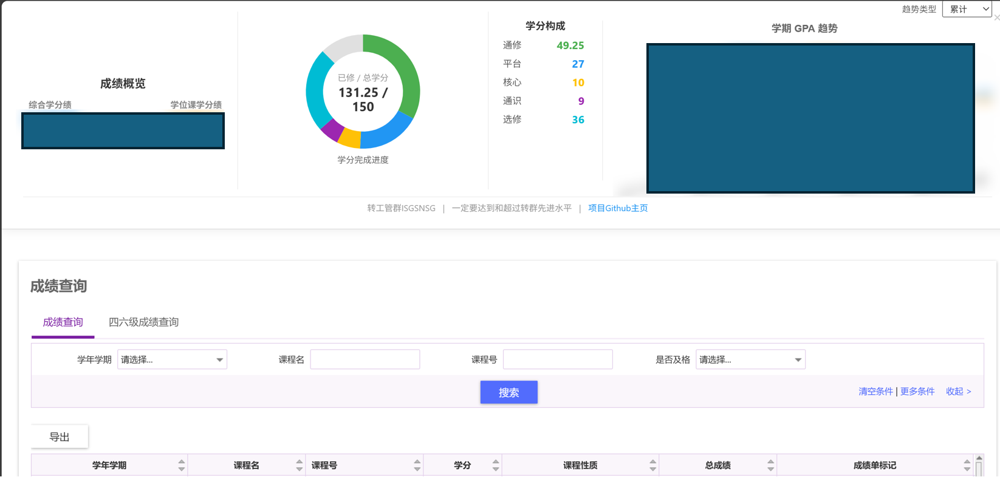
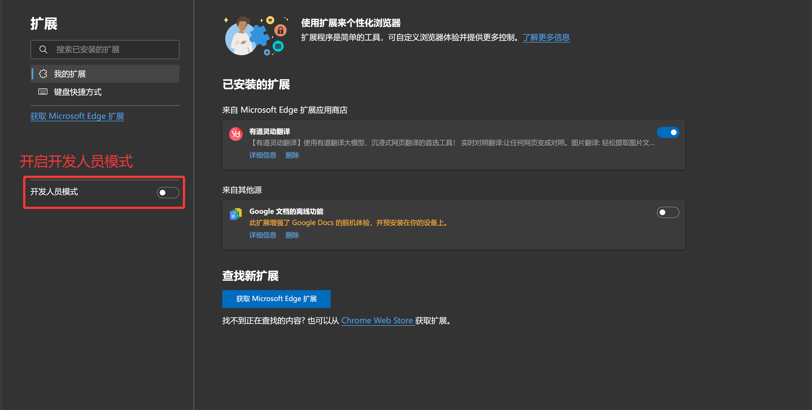
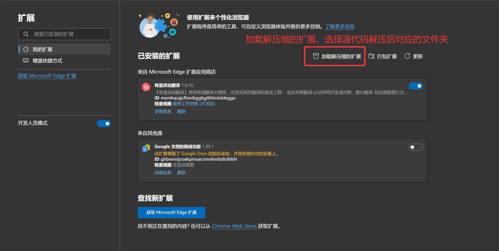
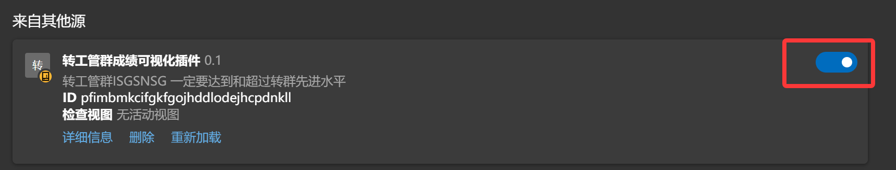
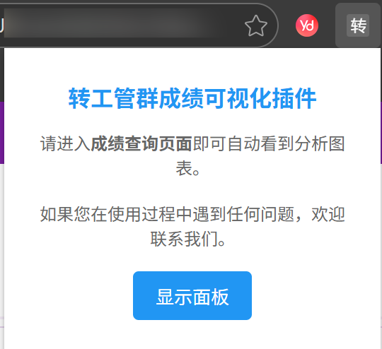
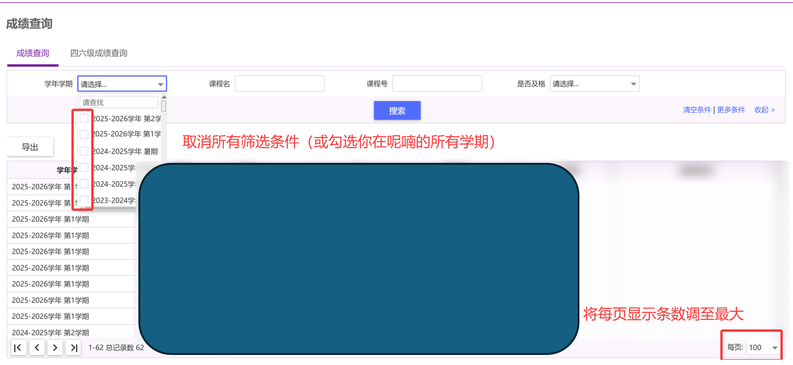

# 转工管群成绩可视化插件

---

转工管群成绩可视化插件是一个用于可视化展示成绩的浏览器插件。它可以帮助用户更直观地了解自己的成绩趋势，以及所修学分的情况。绘图依赖于Chart.js库，绘制学分分布的饼状图与学分绩变化的折线图。

效果图如下。

我们不会传输与存储您的成绩数据。由于涉及到成绩这种隐私数据，我们将插件源代码开源，您可以在GitHub上下载与审阅。同时，我们也十分欢迎您在提交问题报告、功能建议，或者参与插件的开发贡献。

## 使用方法

### 插件安装

您需要先下载插件的源代码，然后在浏览器中安装该插件。安装的具体步骤如下：打开浏览器，进入插件管理页面；点击“加载已解压的扩展程序”或“加载已解压的插件”按钮；选择插件源代码所在的文件夹，点击“确定”或“加载”按钮；插件安装完成后，您可以在浏览器的扩展程序列表中找到该插件。

我们以Edge浏览器为例，展示插件的安装过程如下。

### 插件使用

安装完成后，您需要先登录到成绩查询页面。登录后，插件会自动检测到成绩页面，并在页面顶部显示一个图表。您可以根据图表来了解自己的成绩趋势，以及所修学分的情况。

### 注意事项

如果您想查看自己完整的成绩数据，请注意去掉成绩查询页面上的学期筛选条件，并将每页显示的成绩数量调整为最大（每页显示100条）。如果您的成绩数据超过100条，我们将为您鼓掌。

## 欢迎加入转工管群ISGSNSG

转工管群旨在为有意向了解、分流、转专业进入工程管理学院、机器人与自动化学院的同学提供信息咨询服务与支持，为在工程管理学院、机器人与自动化学院的同学提供信息交流平台。转工管群下设ISGSNSG，旨在实现一些有意思的小东西，帮助群内的同学更轻松愉快地交流学习。

欢迎加入转工管群ISGSNSG，和我们一起，用自己的一点兴趣与能力，共同建设一个有趣而实用的群聊。

## 更新日志

- 版本1.0
  - 修复了重修课程的学分与GPA计算问题
  - 当插件页面被关闭后，你可以点击浏览器的插件图标，在弹出窗口中点击“显示面板”，视图将会重新出现
